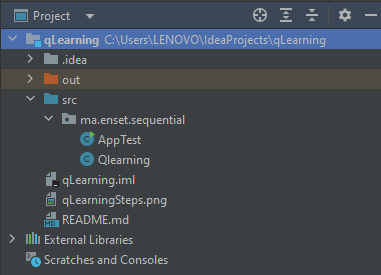
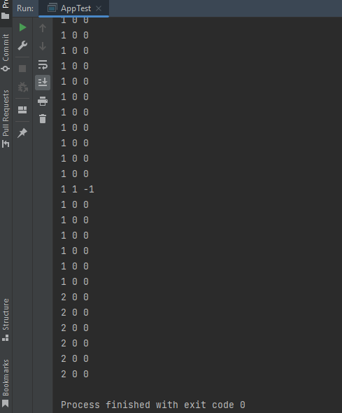

# Q-Learning Algorithm
# Table of contents
<ul>
  <li><a href="#intro">Introduction</a></li>
  <li><a href="#Background">Background</a></li>
  <li><a href="#Components">Key Components of Q-Learning</a></li>
  <li><a href="#Process">Q-Learning Process</a></li>
  <li><a href="#part1">Part-1: Q-Learning Algorithm (Sequential Version)</a></li>
  <li><a href="#sma">Part-2: Multi-Agent Systems and Q-Learning</a></li>
  <li><a href="#Conclusion">Conclusion</a></li>
</ul>
<h1>Table of Figures</h1>
<ul>
  <li><a>Figure 1:  </a></li>
  <li><a>Figure 1:  </a></li>
</ul>
<h1 id="intro">Introduction</h1>

The Q-Learning algorithm is a powerful technique within the field of reinforcement learning, specifically designed to tackle complex decision-making problems. It provides a framework for an agent to learn optimal strategies through an iterative process of interaction with an environment, enabling the agent to adapt and improve its decision-making abilities over time. 
At its core, Q-Learning operates on the principle of trial and error. The agent explores the environment by taking actions and receiving feedback in the form of rewards. By observing these rewards, the agent can learn to associate specific actions with desirable outcomes and adjust its behavior accordingly. The Q-Learning algorithm accomplishes this by estimating the values of state-action pairs, known as Q-values, which represent the expected future rewards for taking a particular action in a given state.
 This report aims to provide a comprehensive demonstration of the Q-Learning algorithm in its sequential version and explore its application in multi-agent systems.

<h1 id="Background">Background</h1>

Reinforcement learning is a prominent subfield of machine learning that focuses on training intelligent agents to make sequential decisions in an environment in order to maximize cumulative rewards. Unlike supervised learning, where the agent learns from labeled examples, and unsupervised learning, where the agent discovers patterns in unlabeled data, reinforcement learning involves an agent interacting with an environment and learning from feedback in the form of rewards or punishments.
 
One popular algorithm within reinforcement learning is Q-Learning. Q-Learning is a model-free and off-policy algorithm, meaning it does not require a prior model of the environment, and it can learn from data generated by any policy. The fundamental concept in Q-Learning is the estimation of action-value functions, commonly referred to as Q-values. These Q-values represent the expected cumulative reward an agent will receive by taking a particular action in a given state.

<h1 id="Components">Key Components of Q-Learning</h1>
<ol>
  <li><b>State and Action Space : </b>
Reinforcement learning involves training an agent to make sequential decisions in an environment to maximize its cumulative reward. Q-Learning is a model-free, off-policy algorithm that does not require a model of the environment. Instead, it learns an action-value function, often called Q-values, which represents the expected reward for taking a particular action in a given state. 
In contrast to other learning approaches, such as supervised or unsupervised learning, reinforcement learning focuses on learning from interactions and feedback rather than pre-existing labeled or unlabeled data. Q-Learning, as a model-free algorithm, bypasses the need for explicit knowledge of the environment's dynamics. By iteratively updating the Q-values based on observed rewards, the algorithm allows the agent to learn the optimal strategy for selecting actions in different states.
  </li>
  <li><b>Q-Table:</b>
  The Q-Table is a data structure used to store the learned Q-values for each state-action pair. Initially, the table is initialized randomly, and as the agent interacts with the environment, it updates the Q-values based on observed rewards.
  </li>
  <li><b>Exploration vs. Exploitation:</b>To learn optimal policies, the agent must strike a balance between exploration and exploitation. Exploration involves taking actions randomly or purposefully to discover new states and actions, while exploitation involves selecting actions based on the learned Q-values to maximize immediate rewards.</li> 
  <li><b>Bellman Equation:</b>The Bellman equation is a fundamental concept in Q-Learning that updates the Q-values based on the observed rewards and the estimated future rewards. It is expressed as:
    <b>Q(s, a) = Q(s, a) + α * (R + γ * max[Q(s', a')] - Q(s, a))</b>
    where: 
    <ul>
      <li>Q(s, a) is the Q-value for state s and action a</li>
      <li>α (alpha) is the learning rate, determining the weight given to new observations</li>
      <li>R is the immediate reward for taking action a in state s</li>
      <li>γ (gamma) is the discount factor, representing the importance of future rewards</li>
      <li>max[Q(s', a')] is the maximum Q-value for the next state s' and all possible actions a' from s'</li>
    </ul>
  </li>
</ol>
<h1 id="Process">Q-Learning Process</h1>

The Q-Learning algorithm follows these steps:
<ul>
  <li><b>Initialize the Q-Table:</b>The Q-Table is a data structure that stores the Q-values for each state-action pair. It is initialized with random values or zeros, depending on the problem. The size of the Q-Table is determined by the number of states and actions in the environment.</li>
  <li><b>Choose an Action:</b>Based on the current state, the agent selects an action using an exploration-exploitation strategy. One commonly used strategy is the ε-greedy policy, where the agent selects a random action with a small probability ε (exploration) and selects the action with the highest Q-value for the current state with a probability of (1-ε) (exploitation).</li>
  <li><b>Perform the Action:</b>The agent performs the selected action in the environment and transitions to the next state.</li>
  <li><b>Measure Reward:</b>After performing the action, the agent receives a reward from the environment based on the action taken and the resulting state. The reward could be positive, negative, or zero, depending on the task and the environment's dynamics.</li>
  <li><b>Update Q-Table:</b>Using the observed reward and the next state, the agent updates the Q-value for the previous state-action pair using the Bellman equation</li>
</ul>
<h1 id=""part1>Part-1: Q-Learning Algorithm (Sequential Version)</h1>
<ul>
  <li><h3 id="str">Structure</h3>
  </li>
  <li><h3 id="execution">Example of execution</h3>
  </li> 
</ul>
<h1>Part-2: Multi-Agent Systems and Q-Learning</h1>
<ul>
  <li><h3 id="main">Main Container</h3>
  
    
The <b>MainContainer</b> class contains a main method, which is the entry point for the program. It starts by obtaining an instance of the JADE runtime using the <b>Runtime.instance()</b> method.
      A <b>ProfileImpl</b> object is created to specify the configuration parameters for the JADE platform. In this case, the parameter <b>Profile.GUI</b> is set to <b>"true"</b>, indicating that a graphical user interface (GUI) should be displayed for the main container.

      The <b>AgentContainer</b> is then created using the <b>createMainContainer</b> method of the runtime, passing the <b>profile</b> as a parameter. This creates the main container that will host the agents in the system.
      Finally, the <b>start</b> method is called on the main container to start its execution. This will initialize the JADE platform and make it ready to host and manage the agents in the system.

  </li>
   <li><h3 id="simple">Simple Container</h3>
     
     
<b>Simple container</b> class for a multi-agent system using the JADE platform. It creates a JADE runtime instance, sets the main host parameter to <b>"localhost"</b>, creates an agent container, creates a specific agent within the container <b>(named "QLearningAgent")</b>, and starts the execution of the agent. This code serves as a basic setup for hosting and running agents in a multi-agent system using JADE.

  </li>
  <li><h3 id="agent">QLearning Agent</h3>
    
     
It represents a Q-learning agent implementation for a grid-based environment. The agent extends the <b>Agent class</b> from the JADE platform and defines the Q-learning algorithm within the <b>QLearningBehaviour class</b>, which extends the <b>SimpleBehaviour class</b>.

    
The agent's Q-learning algorithm is applied to a grid with a size of 3x3. The agent maintains a Q-table to store the Q-values for each state-action pair. The agent uses the epsilon-greedy strategy to choose actions, balancing exploration and exploitation. The Q-values are updated based on the reward received and the maximum Q-value of the next state. The Q-learning process iterates for a maximum number of epochs.

    
The agent's behavior is defined within the action() method of the QLearningBehaviour class. It continues until the maximum number of epochs is reached. In each epoch, the agent resets its state and takes actions until it reaches the goal state. The Q-values are updated during this process.

    
After the Q-learning process is completed, the agent displays the final Q-values stored in the Q-table. It then demonstrates the learned behavior by executing actions in the grid environment until it reaches the goal state. 
Overall, this code implements a Q-learning agent that learns to navigate a grid-based environment and updates its Q-values to optimize its actions based on the rewards received.

  </li>
</ul>
<h1 id="Conclusion">Conclusion</h1>

The Q-Learning algorithm is a powerful technique for training agents to make optimal decisions in complex environments. By learning action-value

