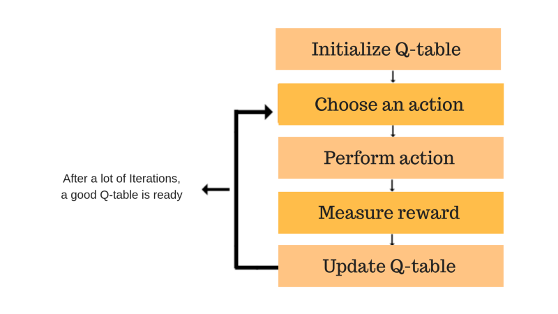

# Q-Learning_Algorithm
<h1>Introduction</h1>

The Q-Learning algorithm is a reinforcement learning technique used to solve complex decision-making problems. 
  It enables an agent to learn optimal strategies by interacting with an environment through a trial-and-error process. 
  This report provides an overview of the Q-Learning algorithm, its key components, and its applications.

<h1>Background</h1>

Reinforcement learning involves training an agent to make sequential decisions in an environment to maximize its cumulative reward. Q-Learning is a model-free,
  off-policy algorithm that does not require a model of the environment. 
  Instead, it learns an action-value function, often called Q-values, which represents the expected reward for taking a particular action in a given state.

<h1>Key Components of Q-Learning</h1>
<ol>
  <li><b>State and Action Space : </b>
  Q-Learning operates in an environment characterized by states and actions. The state space represents the possible configurations or observations of the environment, while the action space represents the available actions the agent can take in each state.
  </li>
  <li><b>Q-Table:</b>
  The Q-Table is a data structure used to store the learned Q-values for each state-action pair. Initially, the table is initialized randomly, and as the agent interacts with the environment, it updates the Q-values based on observed rewards.
  </li>
  <li><b>Exploration vs. Exploitation:</b>To learn optimal policies, the agent must strike a balance between exploration and exploitation. Exploration involves taking actions randomly or purposefully to discover new states and actions, while exploitation involves selecting actions based on the learned Q-values to maximize immediate rewards.</li> 
  <li><b>Bellman Equation:</b>The Bellman equation is a fundamental concept in Q-Learning that updates the Q-values based on the observed rewards and the estimated future rewards. It is expressed as:
    <b>Q(s, a) = Q(s, a) + α * (R + γ * max[Q(s', a')] - Q(s, a))</b>
    where: 
    <ul>
      <li>Q(s, a) is the Q-value for state s and action a</li>
      <li>α (alpha) is the learning rate, determining the weight given to new observations</li>
      <li>R is the immediate reward for taking action a in state s</li>
      <li>γ (gamma) is the discount factor, representing the importance of future rewards</li>
      <li>max[Q(s', a')] is the maximum Q-value for the next state s' and all possible actions a' from s'</li>
    </ul>
  </li>
</ol>
<h1>Q-Learning Process</h1>

The Q-Learning algorithm follows these steps:
<ul>
  <li><b>Initialize the Q-Table:</b>The Q-Table is a data structure that stores the Q-values for each state-action pair. It is initialized with random values or zeros, depending on the problem. The size of the Q-Table is determined by the number of states and actions in the environment.</li>
  <li><b>Choose an Action:</b>Based on the current state, the agent selects an action using an exploration-exploitation strategy. One commonly used strategy is the ε-greedy policy, where the agent selects a random action with a small probability ε (exploration) and selects the action with the highest Q-value for the current state with a probability of (1-ε) (exploitation).</li>
  <li><b>Perform the Action:</b>The agent performs the selected action in the environment and transitions to the next state.</li>
  <li><b>Measure Reward:</b>After performing the action, the agent receives a reward from the environment based on the action taken and the resulting state. The reward could be positive, negative, or zero, depending on the task and the environment's dynamics.</li>
  <li><b>Update Q-Table:</b>Using the observed reward and the next state, the agent updates the Q-value for the previous state-action pair using the Bellman equation</li>
</ul>

